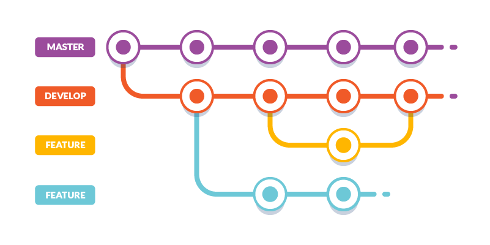
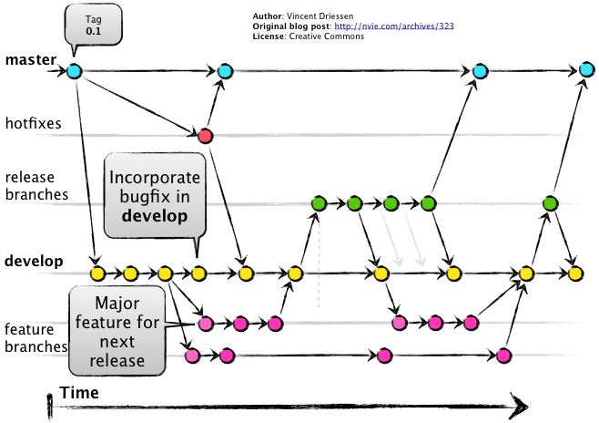

# Clase 03 - Git Desarrollo colaborativo

## Repaso

Recomendacion: En el proyecto deberiamos tener una rama pincipal (main) y una rama de cada uno de los integrantes. Hay que tener cuidado si se asignan mismas funcionalidades ya que puede haber colisiones al momento de fusionar las ramas. 

### Ramas




### Creando una rama

```sh
git branch <nombre-rama>
```

### Listar ramas dentro de un repositorio

```sh
git branch
```