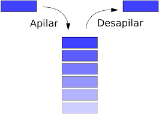

## Clase 04 - Git Desarrollo colaborativo

### Area de Stash

STAGES - Como almacenar cosas que aun no estan para hacer un commit (sin terminar/en proceso). Es una estructura de datos de tipo pila, se puede tener mas de un stash en la caja de stages. Solo se usa de manera individual, no se suben al remoto. Al momento de traer varios stages pueden surgir conlictos, se solucionan igual que los conflictos de fusciones (merge).



#### Crear stashes 

```sh
$ git stash
$ git stash -m "nombre stash" #Se usa en caso de querer ponerle un nombre para identificarlo
```

#### Listar stages

```sh
$ git stash list
```

#### Aplicar un stash (el ultimo)

```sh
$ git stash pop
```
#### Aplicar un stash especifico (rompiendo la estructura de pila)

```sh
$ git stash apply <numero de stash>
```

#### Borrar un stash (el ultimo)

```sh
$ git stash drop
```

